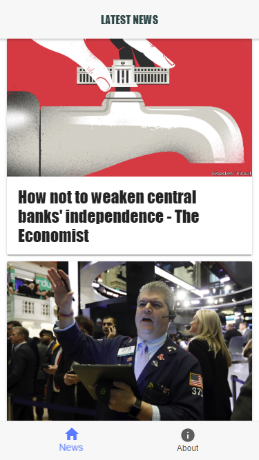
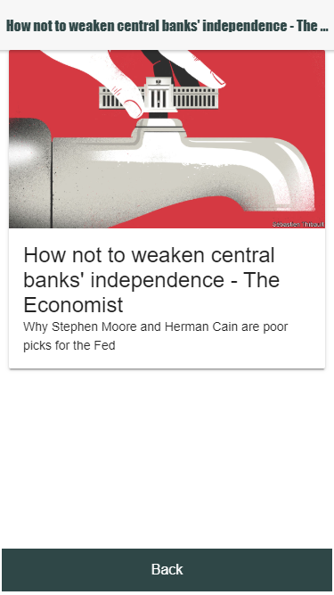
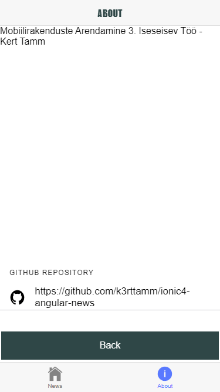

# Ionic 4 Uudiste mobiilne hübriidrakendus

#### Mobiilirakenduste Arendamine 3. Iseseisev Töö - Kert Tamm

Seadistamine:

Kasutasin terminaliks Git Bash'i

Git Bash: projecti loomiseks tuleb installeerida eelnevalt ionic, mida saab teha käsuga npm install -g ionic@latest
(-g tähendab seda, et installeeritakse globaalselt, mitte ainult töötamaks ühes kataloogis ja @latest määrab selle, et installeeritakse kõige viimasem versioon)

Projekti loomist ei hakka siin üksikasjalikult kirjeldama, kuna igaüks valib nii või teisiti omale vastavad installeerimise asukohad jms. Läbisin projekti seadistamisel väga palju erinevaid samme ja tegema mitmeid muudatusi, kuna versioonid ei klappinud näite omaga. Sellegipoolest saab kasutada peamise näitena allpool märgitud juhendi YouTube videot ionicu seadistamiseks.

Seadistamine Visual Studio Code's:

Terminali akna avamiseks VS Code's kasuta ctrl+`. Lisaks vali terminali avanemisel kasutamiseks git bash. Terminalis rakenduse käivitamiseks sisesta käsk ionic serve.

### Kasutatud allikad: 

#### YouTube: 
https://youtu.be/NJ9C7iY9350

#### Github demo repository: 
https://github.com/mbaljeetsingh/ionic4-angular-news

#### Kasutatud API:

https://newsapi.org/

### Arvamus juhendist:
Juhend oli suhteliselt arusaadav, kuid pidin tegema meeletult palju muudatusi, sest Ionic tegi uut rakendust luues leheküljed jms hoopis teistmoodi ja polnud vahet, kas oli installitud täpselt samad versioonid nagu juhendis näidatud või mitte. Algul proovisin ühte teist juhendit ja kulutasin ka selle peale palju aega enne kui nägin projekti lõpupoole, et juhendis olev API polegi enam tasuta saadaval. Peale seda kui Ionic korrektselt seadistatud sai oli kõik juba palju lihtsam.

### Kirjeldus muutustest rakenduse terviklikumaks muutmiseks:
Sai registreeritud API kasutamiseks ja muudetud API location. Muutsin lehtede kujundust CSS'ga ja lisasin väikeste piltide paigutamise uudiste pealehele ning lisaks ka back nupud uudiste ja about lehele. Eemaldatud sai ka mittevajalik kraam.

### Screenshotid:

